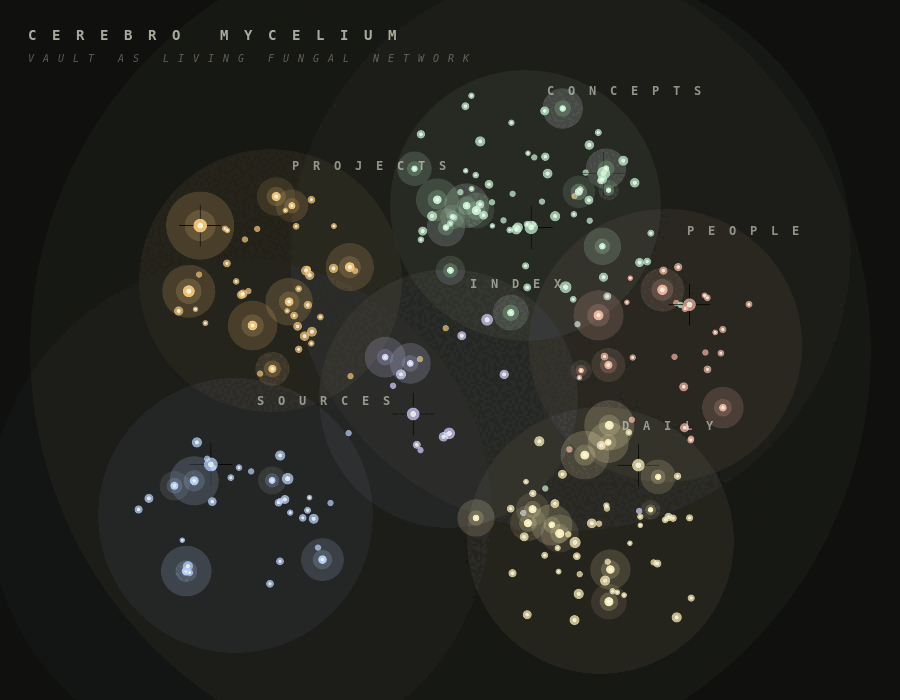

# Cerebro Mycelium

Cerebro Mycelium is an Obsidian community plugin that renders your vault as a 2D living fungal network. Markdown notes become soft kind-clusters, wikilinks become curved hyphae, recently edited notes glow as fruiting bodies, and clicking a node sends a light cascade through its nearby graph.

The animated preview below uses synthetic demo vault data.



## Features

- Native Obsidian custom view, no separate app required.
- Read-only vault adapter built from `metadataCache` and `vault.getMarkdownFiles()`.
- Kind classification from frontmatter, tags, folders, and date-style daily notes.
- Curved multi-fibre hyphae for wikilinks.
- Recent-note fruiting halos driven by `file.stat.mtime`.
- Hover blooms, click cascades, shockwaves, drag pan, and scroll zoom.
- Drag notes to pin them into persistent positions, with a reset command when you want to return to automatic layout.
- Settings for palette, recency window, spore density, cluster haze, decorative micro-leaves, and click behavior.

## Install

Cerebro Mycelium is available in Obsidian's community plugin directory:

```text
https://community.obsidian.md/plugins/cerebro-mycelium
```

1. Open `Settings -> Community plugins`.
2. Search for `Cerebro Mycelium`.
3. Install and enable the plugin.
4. Run **Cerebro Mycelium: Open mycelium** from the command palette.

## Manual Installation

1. Run `npm install`.
2. Run `npm run build`.
3. Copy `manifest.json`, `main.js`, and `styles.css` into:

```text
<your-vault>/.obsidian/plugins/cerebro-mycelium/
```

4. In Obsidian, enable community plugins, then enable **Cerebro Mycelium**.
5. Run **Cerebro Mycelium: Open mycelium** from the command palette.

## Development

```bash
npm install
npm test
npm run build
npm run demo:gif
```

The plugin does not make network requests and does not modify notes. It enumerates markdown files so it can build the vault graph locally.

## Author

Built by [Nichalas Barnes](https://nichalasbarnes.com/), a software engineer and composer. More work at [nichalasbarnes.com/projects](https://nichalasbarnes.com/projects/).

You might also like [Brain Atlas](https://github.com/colorpulse6/brain-atlas), which renders your vault as an animated 3D anatomical brain.

## License

MIT
